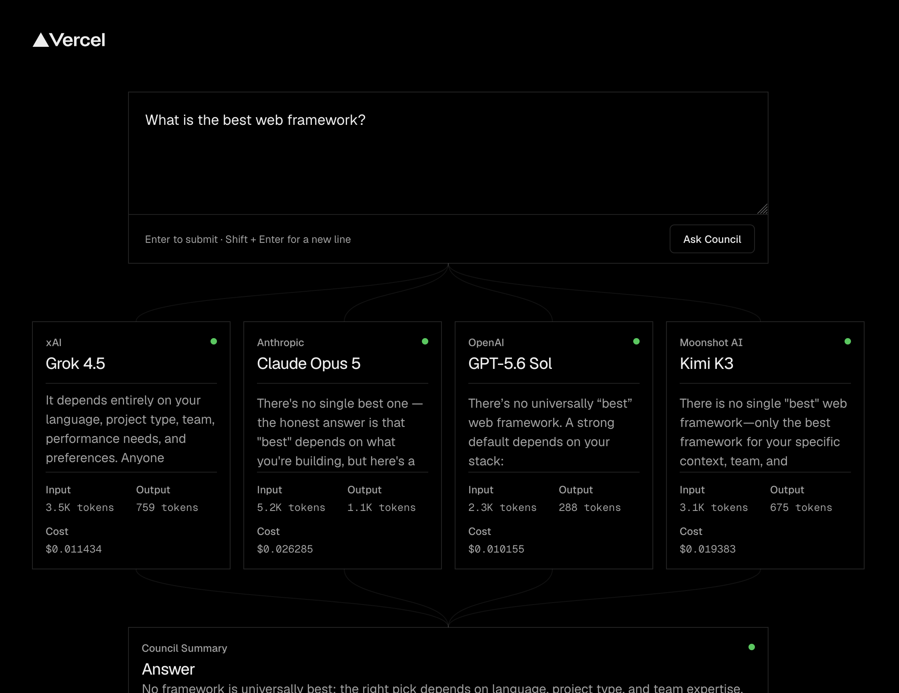

# LLM Council

A small [eve](https://eve.dev) and Next.js demo that sends one prompt to four models in parallel, streams their answers, and asks a judge model for a concise answer with per-model agreement scores.

The council uses:

- xAI Grok 4.5
- Anthropic Claude Opus 5
- OpenAI GPT-5.6 Sol
- Moonshot AI Kimi K3



## Architecture

The application follows one simple flow:

```text
prompt → four parallel council members → judge answer + agreement scores
```

The root [eve agent](https://eve.dev/docs/) delegates the same prompt to four declared [subagents](https://eve.dev/docs/subagents). Each subagent has a fixed AI Gateway model and runs in its own durable session. The Next.js client follows those child [session streams](https://eve.dev/docs/concepts/sessions-runs-and-streaming) so every response appears independently as it is generated.

After all four members finish, the root agent returns a concise answer and per-model agreement scores using a [structured output schema](https://eve.dev/docs/guides/client/output-schema). [`withEve()` and `useEveAgent()`](https://eve.dev/docs/guides/frontend/nextjs) keep the agent routes and UI in the same Next.js application.

The main pieces are:

- `agent/instructions.md` — fan-out and judging behavior
- `agent/subagents/` — the four fixed council members
- `agent/lib/schemas.ts` — final answer and score schema
- `app/council-app.tsx` — submission, child streaming, and rendering

## Run locally

```bash
pnpm install
pnpm exec eve link
pnpm dev
```

`eve link` connects the app to a Vercel project and pulls the AI Gateway credentials needed by the models. Open the local URL printed by Next.js.

## Checks

```bash
pnpm typecheck
pnpm build
```
